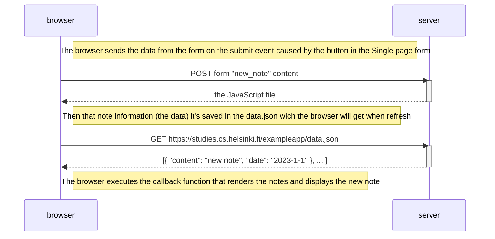

```mermaid
  sequenceDiagram
    participant browser
    participant server

    Note right of browser: The browser sends the data from the form on the submit event caused by the button in the Single page form

    browser->>server: POST form "new_note" content
    activate server
    server-->>browser: the JavaScript file
    deactivate server

    Note right of browser: Then that note information (the data) it's saved in the data.json wich the browser will get when refresh


    browser->>server: GET https://studies.cs.helsinki.fi/exampleapp/data.json
    activate server
    server-->>browser: [{ "content": "new note", "date": "2023-1-1" }, ... ]
    deactivate server

    Note right of browser: The browser executes the callback function that renders the notes and displays the new note
```